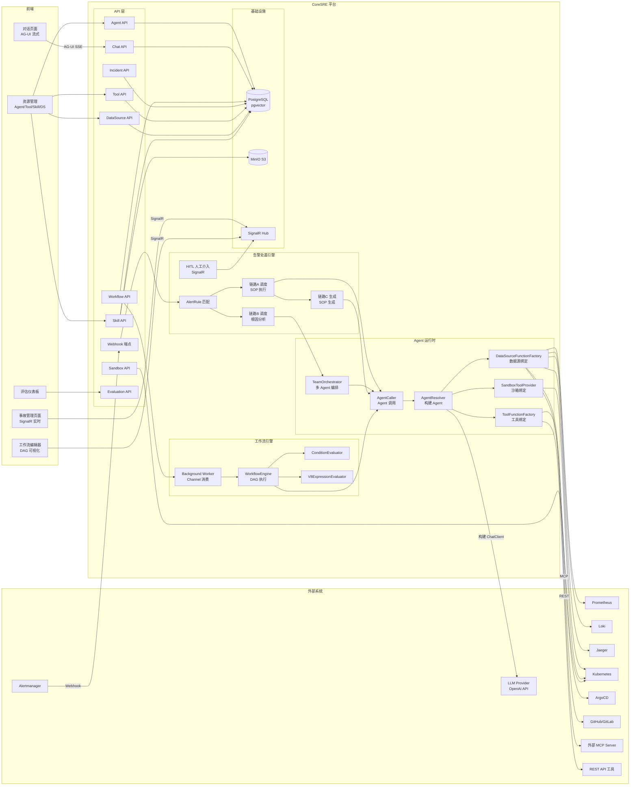
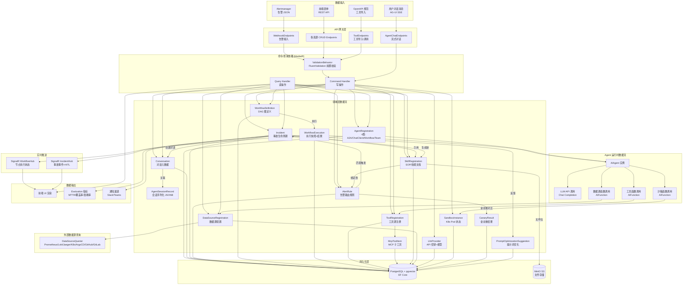
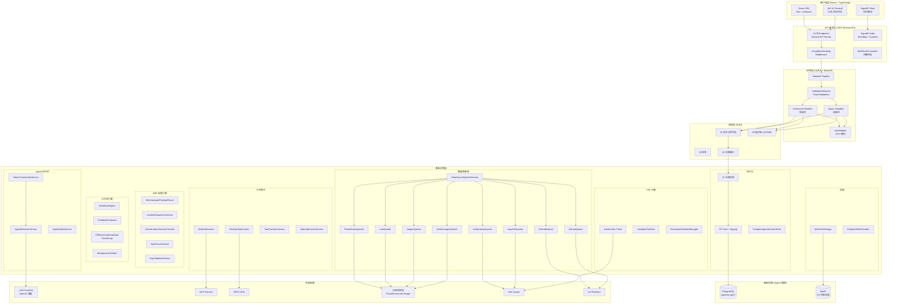
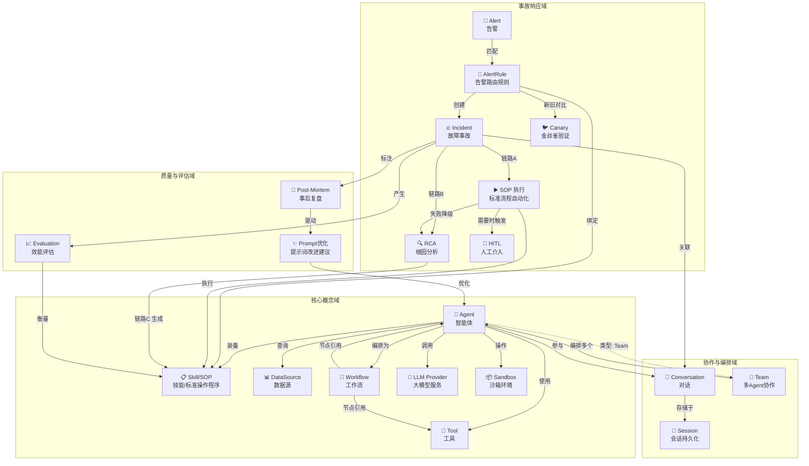

# CoreSRE 系统图表 — Mermaid 源码备份

> 以下 Mermaid 源码对应 Graphviz 生成的 5 张 PNG 图。可直接粘贴到支持 Mermaid 的 Markdown 渲染器中查看。

---

## 1. 业务流程图 — 告警事故处置全链路

```mermaid
flowchart TD
    subgraph 告警接入
        A[Alertmanager Webhook] -->|POST /api/datasources/webhook| B[AlertPayload 解析]
        B --> C{MatchAlertRules<br/>标签匹配}
        C -->|冷却期内| D[丢弃重复告警]
        C -->|匹配到规则| E{判断链路类型}
    end

    subgraph "链路 A — SOP 自动执行"
        E -->|规则绑定 SOP| F[创建 Incident<br/>SopExecution 路由]
        F --> F1[创建 Conversation]
        F1 --> F2[上下文初始化<br/>预查询 DataSource]
        F2 --> G[IIncidentDispatcher<br/>后台调度]
        G --> H[IAgentCaller 调用<br/>Responder Agent]
        H --> H1[解析 SOP 步骤<br/>SopStructuredParser]
        H1 --> H2[逐步执行 SOP<br/>工具调用 + 数据查询]
        H2 --> I{执行结果}
        I -->|成功| J[Incident.Resolve<br/>记录 MTTR]
        I -->|失败/超时| K[降级到链路 B<br/>FallbackToRca]
        I -->|需人工| L[RequestIntervention<br/>HITL 阻塞等待]
    end

    subgraph "链路 B — 根因分析"
        E -->|规则无 SOP| M[创建 Incident<br/>RCA 路由]
        K --> M
        M --> M1[创建 Conversation]
        M1 --> M2[上下文初始化<br/>预查询 DataSource]
        M2 --> N[IIncidentDispatcher<br/>后台调度]
        N --> O[ITeamOrchestrator<br/>多 Agent 协作]
        O --> P[Team Agent 编排<br/>Sequential/Handoffs/etc]
        P --> Q[根因分析结论<br/>SetRootCause]
        Q --> R{是否自动生成 SOP}
    end

    subgraph "链路 C — SOP 自动生成"
        R -->|有 SummarizerAgent| S[GenerateSopFromIncident]
        S --> T[SopGenerationPromptBuilder<br/>构建提示词]
        T --> U[Summarizer Agent<br/>生成 SOP Markdown]
        U --> V[SopParserService<br/>SOP 结构化解析]
        V --> W[SopValidator<br/>校验工具引用]
        W --> X[创建 SkillRegistration<br/>Draft 状态]
    end

    subgraph "SOP 质量保证"
        X --> Y[ValidateSop<br/>结构化校验]
        Y --> Z[DryRunSop<br/>模拟执行]
        Z --> AA[人工审核<br/>Approve/Reject]
        AA -->|通过| AB[PublishSop<br/>Active 状态]
        AB --> AC[绑定到 AlertRule<br/>BindSop]
        AA -->|驳回| AD[Reject 状态]
    end

    subgraph "金丝雀验证"
        AC --> AE[StartCanary<br/>新旧 SOP 对比]
        AE --> AF[Shadow 执行<br/>记录 CanaryResult]
        AF --> AG{结论一致?}
        AG -->|是| AH[PromoteCanary<br/>切换新 SOP]
        AG -->|否| AI[StopCanary<br/>保留旧 SOP]
    end

    subgraph HITL人工介入
        L --> BA[SignalR 推送<br/>InterventionRequest]
        BA --> BB[前端展示<br/>审批/输入/选择]
        BB --> BC[RespondToIntervention<br/>解除阻塞]
        BC --> H2
    end

    subgraph 评估反馈
        J --> CA[Post-Mortem 标注<br/>RCA 准确率评分]
        CA --> CB[Evaluation Dashboard<br/>自动解决率/MTTR/覆盖率]
        CB --> CC[PromptOptimization<br/>建议优化 Agent 提示词]
    end
```

---

## 2. 业务链路图 — 系统交互全景

---

## 3. 数据流转图 — 全系统数据生命周期

---

## 4. 系统架构图 — 分层架构 + 基础设施

---

## 5. 概念图 — 领域模型关系

