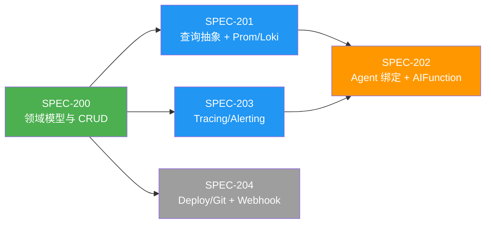

# CoreSRE — SRE 数据源集成 Spec 总览

**文档编号**: DATASOURCE-SPEC-INDEX  
**版本**: 1.0.0  
**创建日期**: 2026-02-17  
**关联文档**: [SPEC-INDEX](SPEC-INDEX.md) | [SRE-DataSource-Integration-Design](../SRE-DataSource-Integration-Design.md)  

> 本文档将 SRE 异构数据源集成能力拆分为可独立交付的 Spec 清单。  
> 目标：让 Agent 像调用工具一样查询 Prometheus/Loki/Jaeger 等 SRE 数据源，提供统一语义层供智能体推理。  
> 原则：镜像 Tool Gateway 的 `ToolRegistration → IToolInvoker → ToolFunctionFactory → AIFunction` 四层架构；每种数据产品一个 Strategy 实现类。  
> 前置依赖：SPEC-001（Agent CRUD）、SPEC-006（LLM Provider）、SPEC-010（Tool Gateway）均已完成。

---

## 设计背景

### 现状

CoreSRE 已有完整的 Agent 编排层（A2A / ChatClient / Workflow / Team）和 Tool Gateway（REST API / MCP 统一调用），但 Agent 无法访问任何 SRE 可观测数据。要实现 AIOps 闭环（告警 → RCA → 修复），Agent 需要统一查询 6 类异构数据源。

### 6 类数据源

| 类别 | 代表产品 | 查询语言 | 数据形态 |
|------|---------|---------|---------|
| **Metrics** | Prometheus, VictoriaMetrics, Mimir | PromQL | TimeSeries（时间戳 + 值） |
| **Logs** | Loki, Elasticsearch, OpenSearch | LogQL / Query DSL | LogEntry（时间戳 + 级别 + 消息） |
| **Tracing** | Jaeger, Tempo, Zipkin | TraceID + Tag Search | Span（traceId + spanId + duration + tags） |
| **Alerting** | Alertmanager, PagerDuty, OpsGenie | Label Matcher | Alert（firing/resolved + labels） |
| **Deployment** | Kubernetes, ArgoCD, Flux | Label Selector | Resource（Kind + Status + Properties） |
| **Git/SCM** | GitHub, GitLab, Azure DevOps | REST | Resource（Commit + MR + Pipeline） |

### 与 Tool Gateway 的本质区别

Tool 是「执行动作」（任意 HTTP/MCP），DataSource 是「结构化数据查询」（有时间轴、有标签、有语义类型）。因此 DataSource 需要：
- **统一查询模型**：`TimeRange + Filters + Expression + Pagination` 四元组
- **类型化响应**：`TimeSeries / LogEntries / Spans / Alerts / Resources` 五种标准响应
- **自动发现**：标签名、索引名、服务名等元数据的发现与缓存

### Agent 绑定模型：DataSourceRef 细粒度控制

与 `LlmConfig.ToolRefs: List<Guid>` 不同，DataSource 绑定需要更细粒度的控制。一个 DataSourceRegistration 可以暴露多个 AIFunction（query、metadata、alerts_list 等），Agent 不一定需要全部。

**绑定模型**：

```
LlmConfigVO
├── ToolRefs: List<Guid>                      ← 现有：Guid = 一个工具/MCP子项
└── DataSourceRefs: List<DataSourceRefVO>      ← 新增：控制到函数级别
    ├── DataSourceId: Guid                     // 绑定哪个数据源
    └── EnabledFunctions: List<string>?        // null = 全部，否则只暴露指定函数
```

每个 DataSourceRegistration 根据其 Category 自动生成一组标准 AIFunction：

| Category | 自动生成的 Functions | 说明 |
|----------|-------------------|------|
| Metrics | `query_metrics_{name}` | PromQL 查询，返回 TimeSeries |
| | `list_metric_names_{name}` | 可用指标名列表 |
| | `list_metric_labels_{name}` | 指定指标的标签名/值 |
| Logs | `query_logs_{name}` | LogQL / Query DSL 查询 |
| | `list_log_labels_{name}` | 可用标签/索引列表 |
| Tracing | `get_trace_{name}` | 按 TraceID 获取完整 Span 树 |
| | `search_traces_{name}` | 按 service + tag 搜索 traces |
| | `list_services_{name}` | 可用服务名列表 |
| Alerting | `list_alerts_{name}` | 当前告警列表 |
| | `get_alert_history_{name}` | 历史告警查询 |
| Deployment | `list_resources_{name}` | K8s/ArgoCD 资源列表 |
| | `get_resource_{name}` | 资源详情 |
| Git | `list_commits_{name}` | 最近提交列表 |
| | `list_pipelines_{name}` | CI/CD 流水线 |

**前端控制**：Agent 编辑页显示已绑定的数据源列表，每个数据源展示可用函数的复选框，用户可以选择性启用。

**示例**：

```json
{
  "dataSourceRefs": [
    {
      "dataSourceId": "uuid-prometheus-prod",
      "enabledFunctions": ["query_metrics_prod_prometheus", "list_metric_names_prod_prometheus"]
    },
    {
      "dataSourceId": "uuid-loki-prod", 
      "enabledFunctions": null
    }
  ]
}
```

上例中：Agent 只绑定了 Prometheus 的查询和列名两个函数（不含标签发现），但 Loki 绑定了全部函数。

---

## Spec 拆分策略

按照**纵向切片 + 渐进式交付**原则拆分为 5 个 Spec：

| Spec | 标题 | 优先级 | 交付价值 |
|------|------|--------|---------|
| SPEC-200 | 数据源领域模型与 CRUD | P1 | 可注册/管理异构数据源，前端可配置 |
| SPEC-201 | 查询抽象 + Prometheus / Loki 实现 | P1 | Agent 可查询指标和日志 |
| SPEC-202 | Agent 绑定与 AIFunction 桥接 | P1 | Agent 像调用工具一样查询数据源 |
| SPEC-203 | Tracing / Alerting 查询实现 | P1 | Agent 可查询追踪和告警 |
| SPEC-204 | Deployment / Git 查询 + Webhook | P2 | Agent 可查询部署和代码变更 |

---

## 模块 M8：SRE 数据源集成

### SPEC-200: 数据源领域模型与 CRUD

**优先级**: P1（Phase 1 — 1 周）  
**前置依赖**: SPEC-001（Agent CRUD）, SPEC-010（Tool Gateway — 架构参考）  

**简述**: 定义数据源领域模型——`DataSourceRegistration` 聚合根、`DataSourceCategory` / `DataSourceProduct` 双枚举、连接配置 VO。实现数据源的完整 CRUD 生命周期（注册 / 查询 / 更新 / 删除 / 连接测试）。前端数据源管理页面。

**核心领域模型**:

```
DataSourceCategory:     Metrics | Logs | Tracing | Alerting | Deployment | Git
DataSourceProduct:      Prometheus | VictoriaMetrics | Mimir | Loki | Elasticsearch |
                        Jaeger | Tempo | Alertmanager | PagerDuty |
                        Kubernetes | ArgoCD | GitHub | GitLab
DataSourceStatus:       Registered | Connected | Disconnected | Error

DataSourceRegistration : BaseEntity
├── Name, Description
├── Category: DataSourceCategory
├── Product: DataSourceProduct
├── Status: DataSourceStatus
├── ConnectionConfig: DataSourceConnectionVO   (JSONB)
│   ├── BaseUrl, AuthType, EncryptedCredential, AuthHeaderName
│   ├── TlsSkipVerify, TimeoutSeconds, CustomHeaders
│   └── Namespace (K8s), Organization (GitHub)
├── DefaultQueryConfig: QueryConfigVO?         (JSONB)
│   ├── DefaultLabels, DefaultNamespace, MaxResults
│   └── DefaultStep (Metrics), DefaultIndex (ES)
├── HealthCheck: DataSourceHealthVO?           (JSONB)
│   ├── LastCheckAt, IsHealthy, ErrorMessage, Version
│   └── ResponseTimeMs
└── Metadata: DataSourceMetadataVO?            (JSONB)
    ├── DiscoveredAt
    ├── Labels, Indices, Services (产品元数据缓存)
    └── AvailableFunctions: List<string> (该数据源可生成的 AIFunction 名列表)
```

**Category ↔ Product 合法映射**（工厂方法强制校验）:

```
Metrics:     [Prometheus, VictoriaMetrics, Mimir]
Logs:        [Loki, Elasticsearch]
Tracing:     [Jaeger, Tempo]
Alerting:    [Alertmanager, PagerDuty]
Deployment:  [Kubernetes, ArgoCD]
Git:         [GitHub, GitLab]
```

**工厂方法**: `CreateMetrics()`, `CreateLogs()`, `CreateTracing()`, `CreateAlerting()`, `CreateDeployment()`, `CreateGit()` — 每个验证 Product ∈ Category。

**CQRS 命令/查询**:

| 操作 | 端点 | Command/Query |
|------|------|--------------|
| 注册 | `POST /api/datasources` | `RegisterDataSourceCommand` |
| 列表 | `GET /api/datasources?category=Metrics` | `GetDataSourcesQuery` |
| 详情 | `GET /api/datasources/{id}` | `GetDataSourceByIdQuery` |
| 更新 | `PUT /api/datasources/{id}` | `UpdateDataSourceCommand` |
| 删除 | `DELETE /api/datasources/{id}` | `DeleteDataSourceCommand` |
| 测试连接 | `POST /api/datasources/{id}/test` | `TestDataSourceConnectionCommand` |
| 发现元数据 | `POST /api/datasources/{id}/discover` | `DiscoverDataSourceMetadataCommand` |

**数据库变更**: 新表 `data_source_registrations`（id, name, description, category, product, status, connection_config jsonb, default_query_config jsonb, health_check jsonb, metadata jsonb, created_at, updated_at）。

**前端**: 数据源管理页 `/datasources` + `/datasources/:id`，类似 Agent/Tool 管理页布局。注册表单按 Category 切换显示不同的 Product 选项和连接配置字段。

---

### SPEC-201: 查询抽象 + Prometheus / Loki 实现

**优先级**: P1（Phase 2 — 1 周）  
**前置依赖**: SPEC-200  

**简述**: 定义统一查询/响应模型（`DataSourceQueryVO` + `DataSourceResultVO`），定义 `IDataSourceQuerier` Strategy 接口 + `DataSourceQuerierFactory`。实现首批两个 Querier：`PrometheusQuerier`（PromQL → TimeSeries）和 `LokiQuerier`（LogQL → LogEntries）。提供 `POST /api/datasources/{id}/query` 统一查询端点。

**核心接口**:

```csharp
// Application/Interfaces/IDataSourceQuerier.cs
public interface IDataSourceQuerier
{
    bool CanHandle(DataSourceProduct product);
    Task<DataSourceResultVO> QueryAsync(
        DataSourceRegistration registration,
        DataSourceQueryVO query,
        CancellationToken ct = default);
    Task<DataSourceHealthVO> HealthCheckAsync(
        DataSourceRegistration registration,
        CancellationToken ct = default);
    Task<DataSourceMetadataVO> DiscoverMetadataAsync(
        DataSourceRegistration registration,
        CancellationToken ct = default);
}

// Application/Interfaces/IDataSourceQuerierFactory.cs
public interface IDataSourceQuerierFactory
{
    IDataSourceQuerier GetQuerier(DataSourceProduct product);
}
```

**统一查询模型**:

```
DataSourceQueryVO
├── TimeRange: TimeRangeVO? (Start, End, Step?)
├── Filters: List<LabelFilterVO>? (Key, Operator [Eq/Neq/Regex/NotRegex], Value)
├── Expression: string? (PromQL / LogQL / TraceID / KQL)
├── Pagination: PaginationVO? (Offset, Limit)
└── AdditionalParams: Dictionary<string, string>? (产品特有参数透传)
```

**统一响应模型**:

```
DataSourceResultVO
├── ResultType: DataSourceResultType (TimeSeries/LogEntries/Spans/Alerts/Resources)
├── TimeSeries: List<TimeSeriesVO>?
│   ├── MetricName, Labels, DataPoints[{Timestamp, Value}]
├── LogEntries: List<LogEntryVO>?
│   ├── Timestamp, Level, Message, Labels, Source, TraceId
├── Spans: List<SpanVO>?
│   ├── TraceId, SpanId, ParentSpanId, OperationName, ServiceName, Duration, Status, Tags
├── Alerts: List<AlertVO>?
│   ├── AlertId, AlertName, Severity, Status, StartsAt, Labels, Annotations, Fingerprint
├── Resources: List<ResourceVO>?
│   ├── Kind, Name, Namespace, Status, Labels, Properties, UpdatedAt
├── TotalCount: int?
└── Truncated: bool
```

**PrometheusQuerier 实现**:
- `CanHandle(Prometheus | VictoriaMetrics | Mimir)` — 三者 API 兼容
- `QueryAsync` → `GET /api/v1/query_range?query={expr}&start={}&end={}&step={}`
- `HealthCheckAsync` → `GET /-/healthy` 或 `GET /api/v1/status/buildinfo`
- `DiscoverMetadataAsync` → `GET /api/v1/labels` + `GET /api/v1/label/__name__/values`
- 响应映射：Prometheus JSON → `TimeSeriesVO`
- **NuGet 依赖**: 无专用查询库（`prometheus-net` 264M 下载仅用于**暴露**指标，不含查询 API），直接用 `HttpClient` + 强类型 DTO

**LokiQuerier 实现**:
- `CanHandle(Loki)`
- `QueryAsync` → `GET /loki/api/v1/query_range?query={logql}&start={}&end={}&limit={}`
- `HealthCheckAsync` → `GET /ready`
- `DiscoverMetadataAsync` → `GET /loki/api/v1/labels`
- 响应映射：Loki JSON → `LogEntryVO`
- **NuGet 依赖**: 无查询库（所有 Loki NuGet 包如 `NLog.Targets.Loki` 仅用于**推送**日志），直接用 `HttpClient` + 强类型 DTO

**CQRS**:

| 操作 | 端点 | Command |
|------|------|---------|
| 统一查询 | `POST /api/datasources/{id}/query` | `QueryDataSourceCommand` |

---

### SPEC-202: Agent 绑定与 AIFunction 桥接

**优先级**: P1（Phase 3 — 1 周）  
**前置依赖**: SPEC-201  

**简述**: 建立 Agent ↔ DataSource 的绑定机制，实现 `DataSourceFunctionFactory` 将数据源查询暴露为 `AIFunction`，Agent 代码无需感知底层产品差异。支持细粒度函数级别控制 —— 前端可选择只启用数据源的部分函数。

**核心设计: DataSourceRefVO**

与 `ToolRefs: List<Guid>` 的简单 Guid 列表不同，DataSource 绑定使用 `DataSourceRefVO` 支持函数级别过滤：

```csharp
// Domain/ValueObjects/DataSourceRefVO.cs
public sealed record DataSourceRefVO
{
    public Guid DataSourceId { get; init; }
    public List<string>? EnabledFunctions { get; init; }  // null = 全部
}
```

**LlmConfigVO 扩展**:

```diff
 public sealed record LlmConfigVO
 {
     ...
     public List<Guid> ToolRefs { get; init; } = [];
+    public List<DataSourceRefVO> DataSourceRefs { get; init; } = [];
     ...
 }
```

**DataSourceFunctionFactory**:

```csharp
// Application/Interfaces/IDataSourceFunctionFactory.cs
public interface IDataSourceFunctionFactory
{
    Task<IReadOnlyList<AIFunction>> CreateFunctionsAsync(
        IReadOnlyList<DataSourceRefVO> dataSourceRefs,
        CancellationToken ct = default);
}
```

**函数生成规则**（按 Category）:

| Category | 生成的 AIFunction | 参数 |
|----------|------------------|------|
| Metrics | `query_metrics_{name}` | expression, start, end, step? |
| | `list_metric_names_{name}` | pattern? |
| | `list_metric_labels_{name}` | metric_name |
| Logs | `query_logs_{name}` | expression, start, end, limit? |
| | `list_log_labels_{name}` | — |
| Tracing | `get_trace_{name}` | trace_id |
| | `search_traces_{name}` | service, operation?, tags?, start, end, limit? |
| | `list_services_{name}` | — |
| Alerting | `list_alerts_{name}` | filter?, state? (firing/resolved) |
| | `get_alert_history_{name}` | alert_name, start, end |
| Deployment | `list_resources_{name}` | kind, namespace?, labels? |
| | `get_resource_{name}` | kind, name, namespace? |
| Git | `list_commits_{name}` | repo?, branch?, since?, until?, limit? |
| | `list_pipelines_{name}` | repo?, status?, limit? |

**细粒度过滤**：`EnabledFunctions` 为 `null` 时暴露该数据源所有 AIFunction；非 null 时只暴露列表中的函数名。

**AgentResolverService 集成**:

```csharp
// 加载 Agent 时同时组装 Tool + DataSource functions
var toolFunctions = await _toolFunctionFactory.CreateFunctionsAsync(llmConfig.ToolRefs);
var dsFunctions = await _dataSourceFunctionFactory.CreateFunctionsAsync(llmConfig.DataSourceRefs);
var allFunctions = toolFunctions.Concat(dsFunctions).ToList();
```

**前端**: Agent 编辑页新增「数据源绑定」区域：
1. 数据源多选列表（类似 ParticipantSelector，按 Category 分组）
2. 选择数据源后展开函数复选框列表
3. 每个函数显示名称 + 简要描述
4. 默认全选，用户可取消不需要的函数

**CQRS 变更**:
- `RegisterAgentCommand` / `UpdateAgentCommand`：`LlmConfig.DataSourceRefs` 新增
- `RegisterAgentCommandValidator` / `UpdateAgentCommandValidator`：验证 DataSourceId 存在、EnabledFunctions 合法
- `AgentRegistrationDto` → `LlmConfigDto.DataSourceRefs` 新增

**不修改数据库 DDL**：`DataSourceRefs` 存储在 `llm_config` JSONB 字段内，向后兼容。

---

### SPEC-203: Tracing / Alerting 查询实现

**优先级**: P1（Phase 4 — 1 周）  
**前置依赖**: SPEC-201  

**简述**: 实现 `JaegerQuerier`、`TempoQuerier`、`AlertmanagerQuerier` 三个 Strategy。扩展 `DataSourceFunctionFactory` 对 Tracing 和 Alerting Category 的函数生成。

**JaegerQuerier 实现**:
- `CanHandle(Jaeger)`
- `QueryAsync`（Expression 有值时按 TraceID 获取）→ `GET /api/traces/{traceId}`
- `QueryAsync`（无 Expression 时按 tag 搜索）→ `GET /api/traces?service={}&tags={}&start={}&end={}&limit={}`
- `DiscoverMetadataAsync` → `GET /api/services` + `GET /api/services/{svc}/operations`
- 响应映射：Jaeger JSON → `SpanVO` 列表
- **NuGet 依赖**: 无查询库（`Jaeger` / `OpenTelemetry.Exporter.Jaeger` 均为**发送** trace，不含查询功能），直接用 `HttpClient`

**TempoQuerier 实现**:
- `CanHandle(Tempo)`  
- `QueryAsync`（TraceID）→ `GET /api/traces/{traceId}`
- `QueryAsync`（搜索）→ `GET /api/search?tags={}&start={}&end={}&limit={}`
- `DiscoverMetadataAsync` → `GET /api/search/tags`

**AlertmanagerQuerier 实现**:
- `CanHandle(Alertmanager)`
- `QueryAsync` → `GET /api/v2/alerts?filter={matchers}&active=true&silenced=false`
- `DiscoverMetadataAsync` → 从 alert 列表提取所有 label keys
- 响应映射：Alertmanager JSON → `AlertVO` 列表
- **NuGet 依赖**: 无（NuGet 搜索 0 结果），直接用 `HttpClient`；Alertmanager v2 API 有 OpenAPI spec 可考虑自动生成客户端

---

### SPEC-204: Deployment / Git 查询 + Webhook

**优先级**: P2（Phase 5 — 1 周）  
**前置依赖**: SPEC-201  

**简述**: 实现 `KubernetesQuerier`、`ArgoCDQuerier`、`GitHubQuerier`、`GitLabQuerier` 四个 Strategy。新增 Webhook 接收端点支持告警推送。新增定时健康检查后台服务。

**KubernetesQuerier 实现**:
- `CanHandle(Kubernetes)`
- `QueryAsync` → KubernetesClient SDK：`ListNamespacedDeploymentAsync`, `ListNamespacedPodAsync` 等
- 按 `Expression` 字段判断资源类型（`kind=Deployment`, `kind=Pod`）
- `DiscoverMetadataAsync` → `ListNamespaceAsync` 获取可用命名空间
- **NuGet 依赖**: ✅ [`KubernetesClient`](https://www.nuget.org/packages/KubernetesClient) v18.0.13（108M 下载，kubernetes-client 官方维护），原生 C# SDK 无需手动 HTTP

**ArgoCDQuerier 实现**:
- `CanHandle(ArgoCD)`
- `QueryAsync` → `GET /api/v1/applications?selector={labels}`
- 响应映射 → `ResourceVO`（Kind=Application, Status=Healthy/Degraded/...）

**GitHubQuerier / GitLabQuerier 实现**:
- `QueryAsync`（commits）→ `GET /repos/{owner}/{repo}/commits?since={}` / `GET /api/v4/projects/{id}/repository/commits`
- `QueryAsync`（pipelines）→ GitHub Actions / GitLab CI Pipelines
- 响应映射 → `ResourceVO`（Kind=Commit/Pipeline）
- **NuGet 依赖**: ✅ GitHub → [`Octokit`](https://www.nuget.org/packages/Octokit) v14.0.0（58M 下载，GitHub 官方维护）；GitLab → 直接用 `HttpClient` 调其 REST API（v4）

**Webhook 端点**（Alertmanager 推送）:
- `POST /api/datasources/webhook/{dataSourceId}` — 接收 Alertmanager webhook payload
- 验证签名 → 转存 → 可选触发 AIOps 工作流

**定时健康检查**:
- `DataSourceHealthCheckBackgroundService` — 每 60s 扫描所有已注册数据源
- 调用 `IDataSourceQuerier.HealthCheckAsync()` 更新 `HealthCheck` JSONB 字段
- 连续失败 3 次 → 状态转 `Error`，恢复 → 状态转 `Connected`

---

## NuGet 依赖分析

经调研，可观测性后端（Prometheus/Loki/Jaeger/Alertmanager）在 .NET 生态中**只有数据导出/推送方向的库，无查询方向客户端**。DevOps 工具（K8s/GitHub）有成熟官方 SDK。

| 数据源 | NuGet 包 | 方向 | 结论 |
|--------|---------|------|------|
| **Prometheus** | `prometheus-net` (264M↓) | 暴露指标 | ❌ 无查询库，用 `HttpClient` |
| **Loki** | `NLog.Targets.Loki` 等 | 推送日志 | ❌ 无查询库，用 `HttpClient` |
| **Jaeger** | `Jaeger` (20M↓) / `OTel.Exporter.Jaeger` | 发送 trace | ❌ 无查询库，用 `HttpClient` |
| **Alertmanager** | 无 (0 结果) | — | ❌ 无任何库，用 `HttpClient` |
| **Kubernetes** | `KubernetesClient` v18.0.13 (108M↓) | 完整 SDK | ✅ 官方 SDK，直接使用 |
| **GitHub** | `Octokit` v14.0.0 (58M↓) | 完整 SDK | ✅ 官方 SDK，直接使用 |
| **GitLab** | 无官方 | — | ❌ 用 `HttpClient` 调 v4 REST API |
| **ArgoCD** | 无 | — | ❌ 用 `HttpClient` 调 REST API |

> **影响**：可观测后端的 REST 查询 API 都很简单稳定（Prometheus 的 HTTP API 自 v2.1 以来未破坏兼容），手动 `HttpClient` + 强类型 DTO 反序列化即可满足需求。每个 Querier 内部封装一个 typed `HttpClient`，通过 `IHttpClientFactory` 注入，共享连接池和 Polly 重试策略。

---

## 与既有架构的对照

| 维度 | Tool Gateway | DataSource Gateway |
|------|-------------|-------------------|
| 实体 | `ToolRegistration` | `DataSourceRegistration` |
| 类型鉴别 | `ToolType` (RestApi/MCP) | `DataSourceProduct` (Prometheus/Loki/...) |
| 调用接口 | `IToolInvoker` | `IDataSourceQuerier` |
| 工厂 | `ToolInvokerFactory` | `DataSourceQuerierFactory` |
| AI 桥接 | `ToolFunctionFactory` → `AIFunction` | `DataSourceFunctionFactory` → `AIFunction` |
| Agent 绑定 | `LlmConfig.ToolRefs: List<Guid>` | `LlmConfig.DataSourceRefs: List<DataSourceRefVO>` |
| 绑定粒度 | Guid = 一个工具 | DataSourceRefVO = 一个数据源 + 可选函数过滤 |
| 连接配置 | `ConnectionConfigVO` + `AuthConfigVO` | `DataSourceConnectionVO`（合并） |
| 查询模型 | 无（工具调用即查询） | `DataSourceQueryVO`（统一四元组） |
| 响应模型 | `ToolInvocationResultDto` (raw JSON) | `DataSourceResultVO`（类型化五种） |

---

## Spec 执行优先级总览

```
P1-DataSource (SRE 数据源集成 — 基础设施接入) ← NEW
  │   详见 [DATASOURCE-SPEC-INDEX](DATASOURCE-SPEC-INDEX.md)
  ├── SPEC-200: 数据源领域模型与 CRUD
  ├── SPEC-201: 查询抽象 + Prometheus / Loki 实现 ★
  ├── SPEC-202: Agent 绑定与 AIFunction 桥接 ★
  └── SPEC-203: Tracing / Alerting 查询实现

P2-DataSource (数据源扩展)
  └── SPEC-204: Deployment / Git 查询 + Webhook + 定时健康检查
```

---

## 依赖拓扑



SPEC-201 和 SPEC-203 可并行开发（都只依赖 SPEC-200），SPEC-202 是汇聚点。

---

## 设计决策记录

| # | 决策 | 替代方案 | 理由 |
|---|------|---------|------|
| D1 | Category 与 Product 分离为两个枚举 | 只用一个 Product 枚举 | Category 是 Agent 视角的语义分类（「问指标」vs「问日志」），Product 是基础设施实现细节；Agent 按 Category 推理，不关心底层是 Prometheus 还是 VictoriaMetrics |
| D2 | `DataSourceRefVO` 含 `EnabledFunctions` 而非简单 `List<Guid>` | 直接绑定 Guid 列表 | 一个数据源自动生成 2-3 个 AIFunction，Agent 不一定全需要；函数级控制避免 prompt 膨胀，减少 token 消耗 |
| D3 | 统一查询 VO（四元组）而非每种 Category 独立查询类型 | 6 种独立 QueryVO | 减少 Agent 学习成本，所有数据源查询参数一致；产品特有参数通过 `AdditionalParams` 透传 |
| D4 | 响应用联合类型（一个 VO 含五种可能）而非每种独立返回类型 | 5 种独立 ResultVO | 简化 AIFunction 的返回类型定义；Agent 总是拿到同样结构的 JSON，根据 `ResultType` 判断解析哪个字段 |
| D5 | ConnectionConfig 合并 auth 字段（不拆 AuthConfigVO） | 独立 AuthConfigVO | 数据源认证模式简单（99% 是 Bearer/APIKey），不需要 OAuth2 流程，合并减少 VO 数量 |
| D6 | 不复用 ToolRegistration | 新增 DataSourceType 到 ToolType 枚举 | Tool 是「执行动作」，DataSource 是「查询数据」——语义不同、查询模型不同、响应模型不同；强行复用导致 ToolRegistration 膨胀，违反 SRP |
| D7 | 元数据（labels/indices/services）缓存在实体 JSONB | 独立 Redis 缓存 | 变化频率低（小时级），JSONB 简单可靠；通过 `POST /discover` 主动刷新即可 |
| D8 | `AvailableFunctions` 存在 Metadata VO 中 | 硬编码在 Category 映射表 | 不同 Product 可能有不同的可用函数集（如 ES 支持聚合但 Loki 不支持），发现后缓存更灵活 |
| D9 | K8s/GitHub 用官方 SDK（`KubernetesClient` + `Octokit`），其余用 `HttpClient` | 全部统一用 HttpClient | 有成熟 SDK 就用 SDK（类型安全、自动分页/重试/认证），可观测后端无查询 SDK 且其 REST API 简单稳定，`HttpClient` + 强类型 DTO 足够 |
